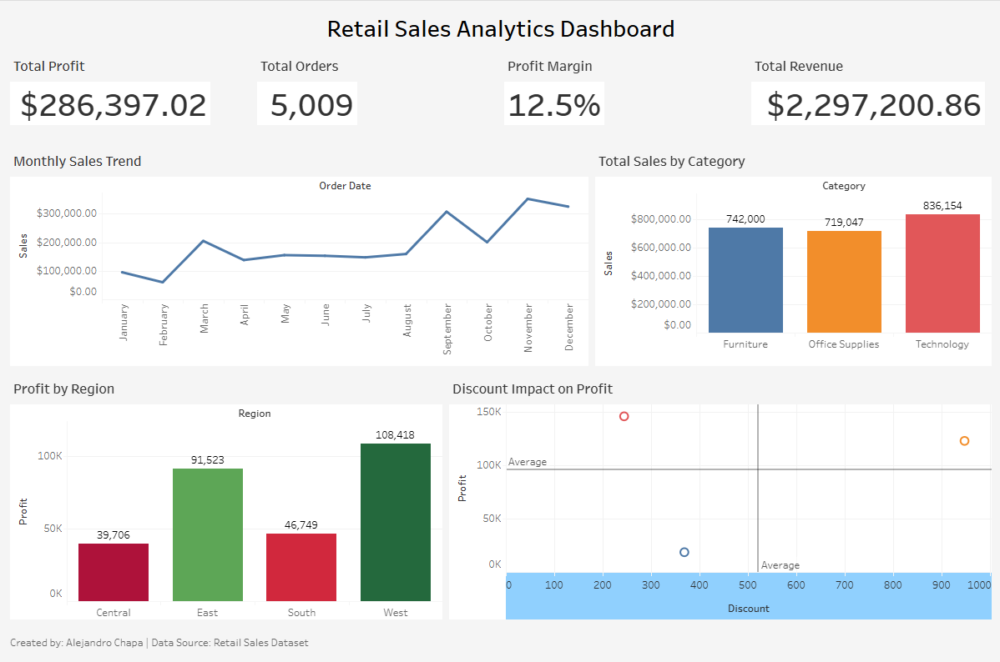
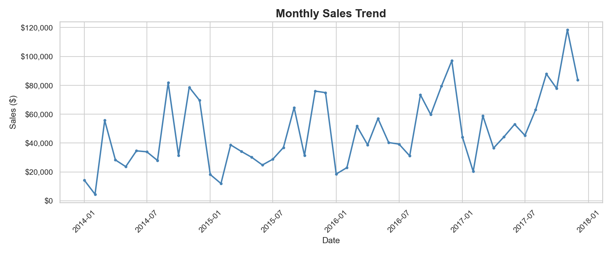
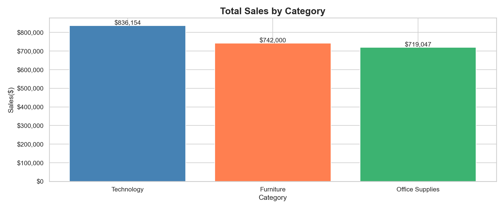
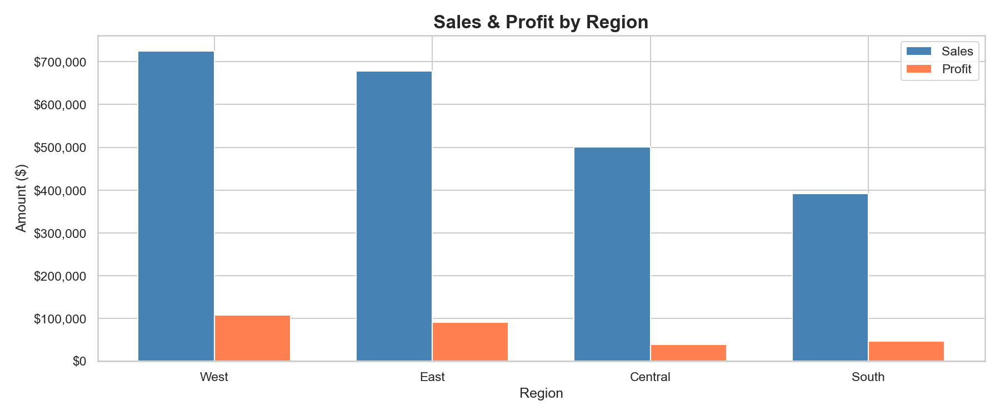
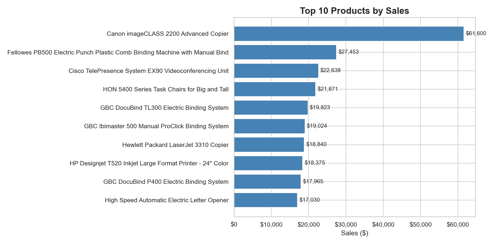
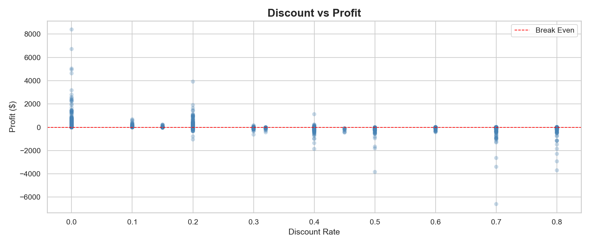

#  Retail Sales Analytics Project

##  Project Overview
End-to-end data analytics project analyzing 4 years of retail sales data 
to uncover revenue trends, profitability drivers, and actionable business 
insights using Python and Tableau.

##  Business Questions Answered
- How has revenue trended over time year over year?
- Which product categories and regions drive the most profit?
- What is the impact of discounting on profit margins?
- Which products are the top and bottom performers?
- How efficient is our order fulfillment and shipping?

##  Key Findings
- Total revenue of $2.3M across 5,009 unique orders from 793 customers
- Technology is the highest revenue category but Office Supplies 
  has the strongest profit margins
- Discounts above 20% consistently produce negative profit margins
- The West region leads in both sales and profitability
- Standard Class shipping accounts for the majority of orders

##  Recommendations
1. Cap discounts at 20% to protect profit margins
2. Invest marketing budget in the West and East regions
3. Review Furniture category pricing strategy to improve margins
4. Promote faster shipping options to high value customers

## 🛠️ Tools & Technologies
| Tool | Purpose |
|------|---------|
| Python (pandas, numpy) | Data cleaning & analysis |
| Matplotlib & Seaborn | Data visualization |
| Tableau Public | Interactive dashboard |
| Excel | Data export & reporting |
| Git & GitHub | Version control |
| Jupyter Notebook | Development environment |

##  Project Structure
retail-sales-analytics/
│
├── data/
│   ├── raw/              ← Original dataset (unmodified)
│   └── clean/            ← Cleaned data & Excel reports
│
├── notebooks/
│   ├── 01_eda.ipynb      ← Data cleaning & EDA
│   └── 02_insights.ipynb ← Business insights & analysis
│
├── visuals/              ← Exported charts & graphs
├── dashboard/            ← Tableau workbook (.twbx)
├── requirements.txt      ← Python dependencies
└── README.md


## 📊 Dashboard
🔗 [View Live Tableau Dashboard](YOUR_TABLEAU_PUBLIC_URL_HERE)



## 📈 Visualizations
### Monthly Sales Trend


### Sales by Category


### Sales & Profit by Region


### Top 10 Products


### Discount vs Profit


## 🚀 How to Run This Project
1. Clone the repository
```bash
git clone https://github.com/achapa4/retail-sales-analytics.git
cd retail-sales-analytics
```

2. Create and activate virtual environment
```bash
python -m venv venv
venv\Scripts\activate
```

3. Install dependencies
```bash
pip install -r requirements.txt
```

4. Launch Jupyter Notebook
```bash
jupyter notebook
```

5. Open notebooks in order:
   - `notebooks/01_eda.ipynb`
   - `notebooks/02_insights.ipynb`

##  Dataset
- **Source:** Sample Retail Sales Dataset
- **Size:** 9,994 rows × 21 columns
- **Time Period:** 4 years of transactional data
- **Fields:** Orders, customers, products, sales, profit, shipping

##  Author
Alejandro Chapa
- GitHub: [achapa4](https://github.com/achapa4)
- LinkedIn: https://www.linkedin.com/in/achapa21/
- Tableau Public: https://public.tableau.com/app/profile/alejandro5671/viz/RetailSalesAnalyticsDashboard_			  17806723371170/SalesAnalyticsDashboard
